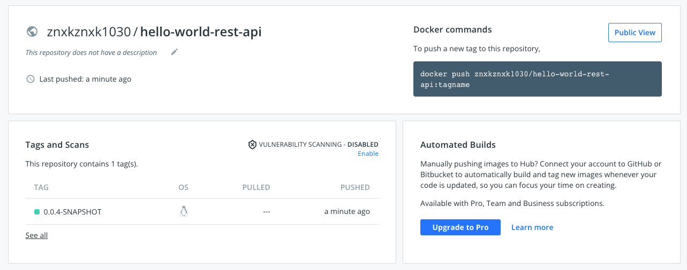
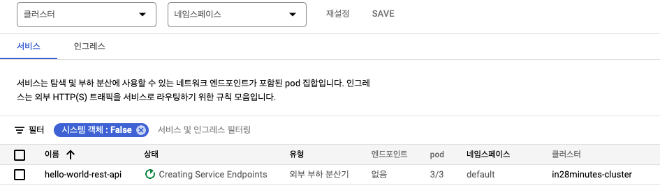

# Kubernetes

## Section 2. 쿠버네티스와 구글 쿠버네티스 엔진 (GKE) 시작하기

### Step 1 - 도커, 쿠버네티스 그리고 구글 쿠버네티스 엔진 시작하기

#### 컨테이너 오케스트레이션

- 수천개의 마이크로서비스의 수천개의 인스턴스 관리하기

#### 특징

1. 오토스케일링
2. 서비스 디스커버리
3. 로드 밸런싱
4. 자기 회복
5. 제로 타임 배포

#### 클라우드 중립

- 어떤 인프라 (AWS, GCP, Azure 등) 이던 간에 표준화된 플랫폼 제공

### Step 2 - 구글 클라우드 계정 생성하기

> <https://cloud.google.com/>

### Step 3 - GKE 쿠버네티스 클러스터 생성하기

#### 클러스터

- 마스터 노드(들): 클러스터를 관리
- 워커 노드(들): 어플리케이션 실행

1. <https://console.cloud.google.com/> 접속
2. Kubernetes Engine 화면 들어가기
3. "생성" 버튼 클릭 ( 최소 생성시, 몇 분 소요 )
4. 클러스터 "만들기" 버튼 클릭 ( 표준 선택 )


#### 노드 풀 & 노드


#### Result


### Step 4 - 쿠버네티스 클러스터 검토 및 쿠버네티스에 관한 흥미로운 사실들

- 발음 [KOO - BER - NET - EEZ]
- 로고 : Helmsman (조타수)
- 클라우드에서 K8S : AKS (Azure), Amazon EKS and GKE (Google)

### Step 5 - 첫 번째 스프링 부트 어플리케이션 쿠버네티스 클러스터에 배치하기

#### CLI 이용하기

<https://shell.cloud.google.com/?hl=ko&fromcloudshell=true&show=terminal>

#### 연결하기

##### 1. 클러스터 > "연결"


##### 2. 명령줄로 액세스하기


##### 3. "kubectel"을 이용해서 명령하기


#### 배포하기

##### 1. 도커 이미지로 인스턴스 생성하기

```shell
kubectl create deployment hello-world-rest-api --image=in28min/hello-world-rest-api:0.0.1.RELEASE
```


##### 2. 인스턴스 노출시키기

```shell
kubectl expose deployment hello-world-rest-api --type=LoadBalancer --port=8080
```


##### 3. 엔드포인트 확인하기


- <http://34.134.85.98:8080/hello-world>


#### 크레딧 아끼기

하루 단위로 수업을 모두 들으신 후 클러스터 노드 사이즈를 0으로 감소시키시면 됩니다.

```shell
gcloud container clusters resize --zone us-central1-a in28minutes-cluster --num-nodes=0
```

다시 시작할 준비가 되셨다면 노드의 숫자를 증가시키세요:

```shell
gcloud container clusters resize --zone us-central1-a in28minutes-cluster --num-nodes=3
```

### Step 06 - 쿠버네티스 개념 간략한 소개 - 파드, 레플리카 세트, 배치

### 모든 파드, 레플리카 세트, 배치 가져오기

```shell
kubectl get events
kubectl get pods
kubectl get replicaset
kubectl get deployment
kubectl get service
```

### 강의에서 쓰이는 명령어들

<https://github.com/in28minutes/kubernetes-crash-course#commands-executed-during-the-course>

### Step 07 - 쿠버네티스의 파드 이해하기

- 쿠버네티스의 가장 작은 단위는 컨테이너가 아닌 파드이다.

```shell
kubectl get pods -o wide
kubectl explain pods # 문서
kubectl describe pod hello-world-rest-api-687d9c7bc7-4nbhf # 더 디테일하게
```

- 포드는 각자의 IP주소를 가진다.
- "1/1" 은 몇개의 컨테이너가 사용가능한지 보여준다.

#### QA와 개발 리소스 구분하기

- QA와 개발 리소스에 각자 다른 네임스페이스를 만들어 각자 특정한 네임스페이스와 반응하도록 한다.

### Step 08 - 쿠버네티스의 레플리카 세트 이해하기

```shell
kubectl get rs # <=> kubectl get replicaset
```

- 포드를 삭제해보기

```shell
kubectl get pods -o wide # get <pod-id>
kubectl delete pods <pod-id> #
```

- 삭제후, 다시 포드를 확인해보면 새로운 파드가 시작됨을 알 수 있다.
- 즉, 포드를 죽이더라고 수초내에 다시 포드가 생성됨을 알 수 있다.

#### 레플리카셋에 더 많은 포드를 유지하도록 하기


```shell
kubectl scale deployment hello-world-rest-api --replicas=3

# 확인하기
kubectl get pods
kubectl get rs
kubectl get events --sort-by=.metadata.creationTimestamp # 시간대별로 이벤트 정렬하기
```

- pods 가 3개로 늘어남을 알 수 있다.


- ScalingReplicaSet 이벤트를 통해 replica set이 확장됨을 알수 있다.


### Step 09 - 쿠버네티스의 배치 이해하기

#### 새로운 이미지로 배포하기 with 제로 다운 타임

```shell
kubectl set image deployment hello-world-rest-api hello-world-rest-api=DUMMY_IMAGE:TEST # 잘못된 이미지를 적용
```

- 이미지에 오류가 생겼지만, 앱이 작동함을 알수있음 ( 이전버전이 동작하고 있음 )
- 2개의 레플리카셋이 있음. 하지만 새이미지꺼는 오류가 있기 때문에 READY 된 파드가 0이고 이전 레플리카세트가 동작하고 있음.


#### 제대로된 이미지로 배포

```shell
kubectl set image deployment hello-world-rest-api hello-world-rest-api=in28min/hello-world-rest-api:0.0.2.RELEASE
```

### Step 11 - 쿠버네티스의 서비스 이해하기

- 서비스는 deployment를 expose시킬때 생성
- 파드가 삭제되고 생성될 때에도 같은 ip를 사용할 수 있도록 한다.
- 서비스는 Load Balancing 으로 구현된다.
- 쿠버네티스의 서비스는 각 클라우드 사 (AWS, Azure, GCP)의 로드밸런서와 완벽하게 동작한다.


- Cluster IP는 클러스내 내부에서만 사용하는 클러스터 서비스 (외부접근 불가능)

### Step 13 - 쿠버네티스 아키텍쳐 이해하기 - 마스터 노드와 일반 노드


#### 마스터 노드

- API Server ( kube-apiserver ) : 구글 클라우드 콘솔과 kubectl이 통신하도록 함
- Distribute Database ( etcd ) : 원하는 상태 (Desired State)가 etcd에 저장 (3-5개 정도 구성하는 걸 추천)
- Scheduler ( kube-scheduler ) : 노드에 포드를 스케쥴링 하는 역할
- Controller Manager ( kube-controller-manager ) : 클러스터의 전반적인 상태를 관리, 쿠버네티스의 실제상태를 원하는 상태와 일치시키는 역할을 함.

#### 워커 노드

- Node Agent ( kubelet ) : 노드 안의 상황을 지켜보고 마스터 노드에 보고하는 일
- Networking Compoent ( kube-proxy ) : 노드 주변의 서비스와 포드를 노출시킴
- Container Runtime ( CRI - docker, rkt, ..etc) : 도커가 유명하지만 다른 oci로도 구성가능
- PODS ( Multiple pods running containers )

#### 마스터 노드 상태 보기

```shell
kubectl get componentstatuses
```


### Step 14 - 구글 클라우드 지역과 지역대 이해하기

#### 여러 리전을 가지는 이유는 무엇일까?

1. 네트워크 지연( latency )을 줄이기 위해서
2. 가용성을 위해서 ( 특정 지역에 재난이 난다면, 다른 리전을 바로 이용할 수 있도록 하기 위해서 )
3. 몇몇 국가들은 국외에 국민들의 정보를 저장하는 것을 원치 않기 때문에

- Zone이란 각 리전에 존재하는 물리적 데이터 센터

## Section 3. GKE - 스프링 부트 Hello World REST API로 쿠버네티스와 도커 사용하기

### Step 1 - 첫 3개 스프링 부트 프로젝트 Eclipse로 불러오기

<https://github.com/in28minutes/kubernetes-crash-course>

#### Import / Existing Maven Projects


#### 폴더 선택


#### 01,02,03 project 선택


#### 디펜던시가 다 다운로드 될 때까지 기다리기


### Step 02 - 로컬 환경에 스프링 부트 Hello World 기반 REST API 01 설치하기


#### Spring Boot 에서 hotloading 기능

```xml
<dependency>
   <groupId>org.springframework.boot</groupId>
   <artifactId>spring-boot-devtools</artifactId>
   <scope>runtime</scope>
</dependency>
```

#### 현재 인스턴스가 어떤 컨테이너에서 실행되고 있는지 확인하기

```java
@Service
public class InstanceInformationService {

 private static final String HOST_NAME = "HOSTNAME";

 private static final String DEFAULT_ENV_INSTANCE_GUID = "LOCAL";   // Default 값은 LOCAL, 향후 클라우드에서 실행될때는 각 인스턴스 별 고유 값을 갖게 된다.

 // @Value(${ENVIRONMENT_VARIABLE_NAME:DEFAULT_VALUE})
 @Value("${" + HOST_NAME + ":" + DEFAULT_ENV_INSTANCE_GUID + "}")
 private String hostName;

 public String retrieveInstanceInfo() {
  return hostName.substring(hostName.length()-5);
 }

}
```

#### 도커 이미지로 만들기

- Dockerfile

```Dockerfile
FROM openjdk:8-jdk-alpine
VOLUME /tmp
EXPOSE 8080
ADD target/*.jar app.jar
ENTRYPOINT [ "sh", "-c", "java -jar /app.jar" ]
```

#### Maven 빌드할때, 도커 이미지도 같이 만들기

- 1.4.6 버전으로 되어있는데 오류나서 1.4.7로 업했더니 정상 동작함.

```xml
<build>
  <finalName>hello-world-rest-api</finalName>
  <plugins>
   <plugin>
    <groupId>org.springframework.boot</groupId>
    <artifactId>spring-boot-maven-plugin</artifactId>
   </plugin>
   <!-- Docker -->
   <plugin>
    <groupId>com.spotify</groupId>
    <artifactId>dockerfile-maven-plugin</artifactId>
    <version>1.4.7</version>
    <executions>
     <execution>
      <id>default</id>
      <goals>
       <goal>build</goal>
       <!-- <goal>push</goal> -->
      </goals>
     </execution>
    </executions>
    <configuration>
     <repository>in28min/${project.name}</repository>
     <tag>${project.version}</tag>
     <skipDockerInfo>true</skipDockerInfo>
    </configuration>
   </plugin>
  </plugins>
 </build>
```

#### 도커 이미지 생성 확인

```shell
[INFO]  ---> 3a9b0134ab6c
[INFO] Successfully built 3a9b0134ab6c
[INFO] Successfully tagged in28min/hello-world-rest-api:0.0.4-SNAPSHOT
```

- in28min/hello-world-rest-api:0.0.4-SNAPSHOT 라는 이름으로 이미지 생성완료

#### 도커 컨테이너 동작 시키기

```shell
docker run -p 8080:8080 znxkznxk1030/hello-world-rest-api:0.0.4-SNAPSHOT
```

### Step 03 - Hello World 기반 Rest API용 도커 허브에서 도커 이미지와 푸시 기능 만들기

#### 생성된 도커 이미지를 퍼블릭 도커 저장소 ( 도커 허브 )에 푸시 시키기

1. 도커 허브에 로그인 하기

```shell
docker login
```


1. 로컬에서 만들어진 이미지 나열하기

```shell
docker images
docker images --filter 'dangling=true' -q --no-trunc # tag 가 <none> 인 이미지들
docker rmi $(docker images --filter 'dangling=true' -q --no-trunc) # tag가 <none> 인 이미지 삭제하기
```

1. pom.xml 수정하고, 다시 빌드하기

```xml
<configuration>
  <repository>znxkznxk1030/${project.name}</repository>
  <tag>${project.version}</tag>
  <skipDockerInfo>true</skipDockerInfo>
</configuration>
```

1. docker-hub에 푸시하기

```shell
docker push znxkznxk1030/hello-world-rest-api:0.0.4-SNAPSHOT
```




### Step 04 - 구글 클라우드 설치하기

<https://cloud.google.com/sdk/docs/quickstart-macos>

#### AttributeError: module 'collections' has no attribute 'Mapping'

- gcloud SDK 는 pyhton 3.10에서는 동작하지 않는다.
- pyhton 3.10버전 이상에서는 CLOUDSDK_PYTHON 를 python2로 지정해서 python 2 버전의 python으로 설치하도록 하자.3

[see more](https://cloud.google.com/storage/docs/gsutil_install#install)

```shell
# .bash_profile
export CLOUDSDK_PYTHON=python2
```

#### 1. gcloud init > 로그인 하기


#### 2. 로그인 화면으로 이동 ( Default 브라우저 이용 )


#### 3. 내 프로젝트 찾기


- cloude 콘솔에서 내 프로젝트 이름/id 확인


#### 4. 리전과 영역은 일단 N

#### 다시 로그인 하기

```shell
gcloud auth login
```

### Step 05 - Kubectl 설치하기

```shell
brew install kubectl
kubectl version # 확인
```

#### 클러스터 연결하기

```bash
$ gcloud container clusters get-credentials in28minutes-cluster --zone us-central1-a --project noble-velocity-343003

# Fetching cluster endpoint and auth data.
# kubeconfig entry generated for in28minutes-cluster.
```


```bash
$ kubectl version

# Client Version: version.Info{Major:"1", Minor:"21", GitVersion:"v1.21.5", GitCommit:"aea7bbadd2fc0cd689de94a54e5b7b758869d691", GitTreeState:"clean", BuildDate:"2021-09-15T21:10:45Z", GoVersion:"go1.16.8", Compiler:"gc", Platform:"darwin/amd64"}
# Server Version: version.Info{Major:"1", Minor:"21", GitVersion:"v1.21.6-gke.1503", GitCommit:"2c7bbda09a9b7ca78db230e099cf90fe901d3df8", GitTreeState:"clean", BuildDate:"2022-02-18T03:17:45Z", GoVersion:"go1.16.9b7", Compiler:"gc", Platform:"linux/amd64"}
```

- kubectl의 Server Version 이 생긴것을 알 수 있다.

### Step 06 - 스프링 부트 Hello World 기반 REST API 01 쿠버네티스에 배치하기

```bash
kubectl set image deployment hello-world-rest-api hello-world-rest-api=in28min/hello-world-rest-api:0.0.4-SNAPSHOT

kubectl get pods
```

#### 배포 히스토리 보기

```bash
kubectl rollout history deployment hello-world-rest-api

# deployment.apps/hello-world-rest-api
# REVISION  CHANGE-CAUSE
# 1         <none>
# 2         <none>
# 3         <none>
# 4         <none>
```

- 변화 원인이 기록되지 않았음

#### 기록 원인 기록하기

```bash
kubectl set image deployment hello-world-rest-api hello-world-rest-api=in28min/hello-world-rest-api:0.0.4-SNAPSHOT --record
```

```bash
kubectl rollout history deployment hello-world-rest-api

# REVISION  CHANGE-CAUSE
# 1         <none>
# 2         <none>
# 3         <none>
# 4         kubectl set image deployment hello-world-rest-api hello-world-rest-api=in28min/hello-world-rest-api:0.0.4-SNAPSHOT --record=true
```

- --record를 입력하면 변화를 야기한 명령어를 기록합니다

#### 특정 revision 으로 롤백시키기

```bash

# REVISION  CHANGE-CAUSE
# 1         <none>
# 2         <none>
# 3         <none>
# 4         kubectl set image deployment hello-world-rest-api hello-world-rest-api=in28min/hello-world-rest-api:0.0.4-SNAPSHOT --record=true

kubectl rollout undo deployment hello-world-rest-api --to-revision=3

# deployment.apps/hello-world-rest-api rolled back

kubectl rollout status deployment hello-world-rest-api # 확인
```

#### watch

- google clould shell에서는 깔려있고, 내가 내 터미널에서 쓰려면 따로 설치해야함.

```bash
watch curl http://34.134.85.98:8080/hello-world
```

- 2초마다 접근해주는 명령어

### Step 07 - 배치 및 서비스를 위한 쿠버네티스 YAML 설정 생성하기

#### 디플로이먼트에 대한 모든 세부사항이 담긴 YAML 파일 보기

```bash
kubectl get deployment hello-world-rest-api -o yaml

# deployment.yaml 파일 생성
kubectl get deployment hello-world-rest-api -o yaml > deployment.yaml
```

#### expose deployment로 만든 서비스 정보를 가져오기

```bash
kubectl get service hello-world-rest-api -o yaml

# service.yaml 파일 생성
kubectl get service hello-world-rest-api -o yaml > service.yaml
```

#### deployment.yaml 수정하기 ( replicas: 3 -> 2)

```yaml
---
spec:
  progressDeadlineSeconds: 600
  replicas: 2
```

```bash
kubectl apply -f deployment.yaml

kubectl get pods # 확인 ( pods가 2개로 줄어든것을 확인 할 수 있다. )
```


### Step 08 - 쿠버네티스 YAML 설정의 이해 및 개선

#### deployment.yaml 과 service.yaml 합치기

- --- 넣어서 두개 합치기

```yaml
# deployment.yaml
readyReplicas: 3
replicas: 3
updatedReplicas: 3
---
apiVersion: v1
kind: Service
metadata:
# service.yaml
```

#### 불필요한 내용 지우기

- 어너테이션, 디플로이먼트 버전, 생성 타임 스탬프, 제너레이션, 리소스 버전, 셀프링크, uid, 진행마감시간, 리비전 히스토리 리밋, terminationMessagePath, terminatjionMessagePolicy, dnsPolicy, schedulerName, securityContent, 스테이터스 전체

#### 정리되고 남은 yaml 파일

```yaml
apiVersion: apps/v1
kind: Deployment
metadata:
  labels:
    app: hello-world-rest-api
  name: hello-world-rest-api
  namespace: default
spec:
  replicas: 3
  selector:
    matchLabels:
      app: hello-world-rest-api
  strategy:
    rollingUpdate:
      maxSurge: 25%
      maxUnavailable: 25%
    type: RollingUpdate
  template:
    metadata:
      labels:
        app: hello-world-rest-api
    spec:
      containers:
        - image: in28min/hello-world-rest-api:0.0.2.RELEASE
          imagePullPolicy: IfNotPresent
          name: hello-world-rest-api
          resources: {}
      terminationGracePeriodSeconds: 30
---
apiVersion: v1
kind: Service
metadata:
  labels:
    app: hello-world-rest-api
  name: hello-world-rest-api
  namespace: default
spec:
  ports:
    - nodePort: 32393
      port: 8080
      protocol: TCP
      targetPort: 8080
  selector:
    app: hello-world-rest-api
  sessionAffinity: None
  type: LoadBalancer
```

#### 현재 서버에서 돌고있는 앱 지우기

```bash
kubectl delete all -l app=hello-world-rest-api # 라벨로 한번에 지우기

kubectl get all
# NAME                 TYPE        CLUSTER-IP   EXTERNAL-IP   PORT(S)   AGE
# service/kubernetes   ClusterIP   10.72.0.1    <none>        443/TCP   7d4h
```


### 스크레치에서 deployment.yaml 만으로 배포 가능한지 확인하기

```yaml
kubectl apply -f deployment.yaml

kubectl get all
# NAME                                        READY   STATUS    RESTARTS   AGE
# pod/hello-world-rest-api-7ddff5dfc6-bjsv7   1/1     Running   0          40s
# pod/hello-world-rest-api-7ddff5dfc6-nng86   1/1     Running   0          40s
# pod/hello-world-rest-api-7ddff5dfc6-zdhhj   1/1     Running   0          40s

# NAME                           TYPE           CLUSTER-IP     EXTERNAL-IP   PORT(S)          AGE
# service/hello-world-rest-api   LoadBalancer   10.72.12.255   <pending>     8080:32393/TCP   41s
# service/kubernetes             ClusterIP      10.72.0.1      <none>        443/TCP          7d4h

# NAME                                   READY   UP-TO-DATE   AVAILABLE   AGE
# deployment.apps/hello-world-rest-api   3/3     3            3           42s

# NAME                                              DESIRED   CURRENT   READY   AGE
# replicaset.apps/hello-world-rest-api-7ddff5dfc6   3         3         3       42s
# yskimui-MacBook-Pro:k8s-learn yskim$ kubectl get all
# NAME                                        READY   STATUS    RESTARTS   AGE
# pod/hello-world-rest-api-7ddff5dfc6-bjsv7   1/1     Running   0          100s
# pod/hello-world-rest-api-7ddff5dfc6-nng86   1/1     Running   0          100s
# pod/hello-world-rest-api-7ddff5dfc6-zdhhj   1/1     Running   0          100s

# NAME                           TYPE           CLUSTER-IP     EXTERNAL-IP      PORT(S)          AGE
# service/hello-world-rest-api   LoadBalancer   10.72.12.255   34.133.205.226   8080:32393/TCP   100s
# service/kubernetes             ClusterIP      10.72.0.1      <none>           443/TCP          7d4h

# NAME                                   READY   UP-TO-DATE   AVAILABLE   AGE
# deployment.apps/hello-world-rest-api   3/3     3            3           100s

# NAME                                              DESIRED   CURRENT   READY   AGE
# replicaset.apps/hello-world-rest-api-7ddff5dfc6   3         3         3       101s
```



## Section 4: GKE - 쿠버네티스 선언형 설정 및 관리 활용하기

[labels vs matchLabels](https://stackoverflow.com/questions/63875585/service-selector-vs-deployment-selector-matchlabels)

```text
Simple as that - in the service spec.selector you can identify which pods to route traffic to only by their labels.

On the other hand, in the Deployment spec.selector you have two options to decide on which node the pods will be scheduled on, which are: matchExpressions, matchLabels.

let me know if it answers your question :)
```

### Step 02 - minReadySeconds를 활용하여 릴리즈 소요시간 감소시키기

```bash
kubectl diff -f deployment.yaml

kubectl apply -f deployment.yaml
watch -n 0.1 http://34.133.205.226:8080/hello-world
kubectl get pods
```

```yaml
---
spec:
  replicas: 3
  minReadySeconds: 45 # 첫 45초 동안 포드가 시작할 수 있도록 보장
```

- minReadySeconds를 이용하여 좀더 안정된 릴리즈를 할 수 있게됌.

### Step 03 - 쿠버네티스 YAML 설정을 활용한 레플리카 세트의 심화 이해

```yaml
22 -kind: Deployment
23 +kind: ReplicaSet
```

#### 변경된 deployment.yaml 적용

```bash
kubectl delete all -l app=hello-world-rest-api
kubectl apply -f deployment.yaml
```

- unknown field "strategy" 에러발생
- Deployment는 새 릴리즈를 책임지지만 ReplicaSet은 이를 책임 지지 않기 때문

```yaml
# strategy:
#   rollingUpdate:
#     maxSurge: 25%
#     maxUnavailable: 25%
#   type: RollingUpdate
```

```bash
kubectl apply -f deployment.yaml
kubectl get all
```

- 포드, 서비스는 존재하지만 디플로이먼트는 만들지 않아서 확인할 수 없음.
- 서비스를 만들기 위해서 디플로이먼트가 항상 필요한 것은 아니다.

#### 디플로이먼트 없이 새로운 버전 배포 ( 0.0.3 => 0.0.2 )

```yaml
- - image: in28min/hello-world-rest-api:0.0.3.RELEASE
+ - image: in28min/hello-world-rest-api:0.0.2.RELEASE
```

```bash
kubectl apply -f deployment.yaml
```

- 새로운 릴리즈가 반영되지 않음.
- 레플리카 셋은 그저 2개의 포드가 제대로 동작학 있으니 더이상 신경쓰지 않음
- 레플리카셋: 내 역할은 포드를 2개 정상적을 돌리는 거고, 정상적이니 난 더이상 할 일이 없어!

#### 그렇다면, 프드를 하나 지워보자

```bash
kubectl delete pod hello-world-rest-api-7xr5v

# pod "hello-world-rest-api-7xr5v" deleted
```

- V3와 V2가 벌갈아 보임.
- 지워진 포드가 새로운 버전인 V2로 생성된 것을 알 수 있음.

### Step 04 - One Service를 활용한 여러 쿠버네티스 배치 설정하기

#### metadata/matchLabel > labels에 "version: v1" 추가

```yaml
kind: Deployment
metadata:
  labels:
    app: hello-world-rest-api
    version: v1
  name: hello-world-rest-api-v1
  namespace: default
```

```yaml
selector:
  matchLabels:
    app: hello-world-rest-api
    version: v1
```

#### v1으로 되어있는 Deployment ( ~ 33번째 라인) 복사해서 그대로 붙여넣고 v1을 v2로 고치기

> v1은 0.0.1.RELEASE 이미지 배포, v2는 0.0.2.RELEASE 이미지 배포

#### 서비스쪽 메타데이터는 변하지 않음 ( 오직 app: hello-world-rest-api 만 가지고 있음)

```yaml
kind: Service
metadata:
  labels:
    app: hello-world-rest-api
  name: hello-world-rest-api
  namespace: default
```

#### 모든 리소스 삭제 및 deployment.yaml 다시 올리기

```bash
kubectl delete all -l app=hello-world-rest-api


# pod "hello-world-rest-api-48z4c" deleted
# pod "hello-world-rest-api-cxtsb" deleted
# pod "hello-world-rest-api-fg65d" deleted
# service "hello-world-rest-api" deleted
# deployment.apps "hello-world-rest-api" deleted
# replicaset.apps "hello-world-rest-api" deleted
```

```bash
kubectl apply -f deployment.yaml

# deployment.apps/hello-world-rest-api-v1 created
# deployment.apps/hello-world-rest-api-v2 created
# service/hello-world-rest-api created

kubectl get pods

# NAME                                       READY   STATUS    RESTARTS   AGE
# hello-world-rest-api-v1-669dcc4c54-4zbnm   1/1     Running   0          15s
# hello-world-rest-api-v1-669dcc4c54-5nj82   1/1     Running   0          15s
# hello-world-rest-api-v1-669dcc4c54-d9mcj   1/1     Running   0          15s
# hello-world-rest-api-v2-6bb879b88-dhw7g    1/1     Running   0          14s
# hello-world-rest-api-v2-6bb879b88-m5546    1/1     Running   0          15s
# hello-world-rest-api-v2-6bb879b88-mdxtk    1/1     Running   0          14s
```

- v1,v2각 3개씩 총 6개 생성

```bash
kubectl get all -o wide

# NAME                                           READY   STATUS    RESTARTS   AGE     IP           NODE                                                 NOMINATED NODE   READINESS GATES
# pod/hello-world-rest-api-v1-669dcc4c54-4zbnm   1/1     Running   0          2m22s   10.68.2.14   gke-in28minutes-cluster-default-pool-2d6d2a3d-01tm   <none>           <none>
# pod/hello-world-rest-api-v1-669dcc4c54-5nj82   1/1     Running   0          2m22s   10.68.1.20   gke-in28minutes-cluster-default-pool-2d6d2a3d-6rm8   <none>           <none>
# pod/hello-world-rest-api-v1-669dcc4c54-d9mcj   1/1     Running   0          2m22s   10.68.0.13   gke-in28minutes-cluster-default-pool-2d6d2a3d-4qlm   <none>           <none>
# pod/hello-world-rest-api-v2-6bb879b88-dhw7g    1/1     Running   0          2m21s   10.68.0.14   gke-in28minutes-cluster-default-pool-2d6d2a3d-4qlm   <none>           <none>
# pod/hello-world-rest-api-v2-6bb879b88-m5546    1/1     Running   0          2m22s   10.68.1.21   gke-in28minutes-cluster-default-pool-2d6d2a3d-6rm8   <none>           <none>
# pod/hello-world-rest-api-v2-6bb879b88-mdxtk    1/1     Running   0          2m21s   10.68.2.15   gke-in28minutes-cluster-default-pool-2d6d2a3d-01tm   <none>           <none>

# NAME                           TYPE           CLUSTER-IP   EXTERNAL-IP      PORT(S)          AGE     SELECTOR
# service/hello-world-rest-api   LoadBalancer   10.72.1.93   34.133.205.226   8080:32393/TCP   2m22s   app=hello-world-rest-api
# service/kubernetes             ClusterIP      10.72.0.1    <none>           443/TCP          10d     <none>

# NAME                                      READY   UP-TO-DATE   AVAILABLE   AGE     CONTAINERS             IMAGES                                       SELECTOR
# deployment.apps/hello-world-rest-api-v1   3/3     3            3           2m23s   hello-world-rest-api   in28min/hello-world-rest-api:0.0.1.RELEASE   app=hello-world-rest-api,version=v1
# deployment.apps/hello-world-rest-api-v2   3/3     3            3           2m23s   hello-world-rest-api   in28min/hello-world-rest-api:0.0.2.RELEASE   app=hello-world-rest-api,version=v2

# NAME                                                 DESIRED   CURRENT   READY   AGE     CONTAINERS             IMAGES                                       SELECTOR
# replicaset.apps/hello-world-rest-api-v1-669dcc4c54   3         3         3       2m24s   hello-world-rest-api   in28min/hello-world-rest-api:0.0.1.RELEASE   app=hello-world-rest-api,pod-template-hash=669dcc4c54,version=v1
# replicaset.apps/hello-world-rest-api-v2-6bb879b88    3         3         3       2m24s   hello-world-rest-api   in28min/hello-world-rest-api:0.0.2.RELEASE   app=hello-world-rest-api,pod-template-hash=6bb879b88,version=v2
```

- 서비스는 라벨이 "app=hello-world-rest-api" 하나지만, 디플로이먼트는 라벨이 "app=hello-world-rest-api,version=v2"로 2개임을 알 수 있다.

```bash
watch curl 34.133.205.226:8080/hello-world

#   % Total    % Received % Xferd  Average Speed   Time    Time     Time  Current
#                                  Dload  Upload   Total   Spent    Left  Speed
#    0     0    0     0    0     0      0      0 --:--:-- --:--:-- --:--:--     0   0     0    0     0    0     0      0      0 --:--:-- --:--:-- --:--:--     0 100    21  100
#   21    0     0     58      0 --:--:-- --:--:-- --:--:--    59
# Hello World  V2 m5546
```

- v1과 v2가 계속 반복해서 변하는걸 볼 수 있다.

#### V2 인스턴스에게만 부하 보내기 | Servive 라벨에 "version: v2" 추가하기

```yaml
kind: Service
metadata:
  labels:
    app: hello-world-rest-api
    version: v2
```

```bash
kubectl apply -f deployment.yaml 
# deployment.apps/hello-world-rest-api-v1 unchanged
# deployment.apps/hello-world-rest-api-v2 unchanged
# service/hello-world-rest-api configured
```

- watch를 통해 보면, v2 만 부하를 받는 것을 알 수 있다.
